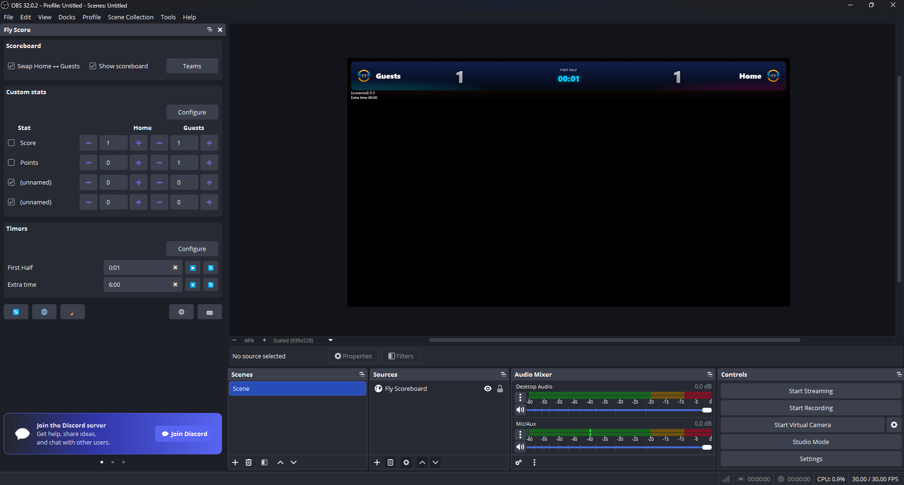

# 🏆 Fly Scoreboard - OBS Studio Plugin (2025 Edition)

A modern, **team‑agnostic, auto‑updating scoreboard overlay** for OBS Studio.  
Fly Scoreboard now uses a fully flexible **team_x / team_y architecture**, dynamic custom fields, multiple timers, live swapping, and a clean browser-based overlay powered by a lightweight built‑in web server.

[](https://ko-fi.com/mmltech)

---

## 🖼️ Preview

<p align="center">
  <picture>
    
  </picture>
</p>

---

## ✨ Features

### 🆕 2025 Engine (team_x / team_y)
- Flexible **team order** (swap dynamically)
- Custom fields mapped to **x/y** values (no more home/away hardcoding)
- Future-proof overlay structure for any sport or event

### Core Features
- 🕐 **Multi‑Timer System**  
  Count up/down, pause, reset, extra timers, and synchronized overlay updates.
- 🏁 **Dock Controls**  
  Adjust scores, fields, timers, and visibility instantly.
- 🎮 **Hotkey Support**  
  Bind keys for +1/−1, swap teams, start/pause/reset timers, and show/hide scoreboard.
- 🌐 **Web Overlay**  
  Lightweight auto-generated overlay served locally with seamless live updates.
- 🏞️ **Logos & Branding**  
  Upload team logos; plugin handles hashing, copying, and cache‑safe filenames.
- 🧹 **Reset Tools**  
  Clear team info, reset fields, delete logos, restore defaults in one click.
- ⚙️ **Settings Dialog**  
  Configure server port, open overlay folder, enable/disable health check, etc.

> ⚡ **No dependencies** besides OBS SDK + Qt. Fast, safe, and extremely lightweight.

---

## 📦 Installation

### ✔ Recommended - Download Release ZIP

1. Download the latest release:  
   **https://github.com/mmlTools/fly-scoreboard/releases**
2. Extract into OBS plugins directory:  
   ```
   C:\Program Files\obs-studio\obs-plugins4bit   ```
3. Restart OBS → `View → Docks → Fly Scoreboard`.

---

## 🛠 Building From Source

### Windows (Visual Studio 2022)

```bash
cmake -S . -B build -G "Visual Studio 17 2022" -A x64 ^
  -DENABLE_FRONTEND_API=ON -DENABLE_QT=ON -DCMAKE_COMPILE_WARNING_AS_ERROR=OFF

cmake --build build --config Release
cmake --install build --config Release --prefix "E:\obs-studio"
```

### Linux / macOS

```bash
cmake -S . -B build -DCMAKE_BUILD_TYPE=Release   -DENABLE_FRONTEND_API=ON -DENABLE_QT=ON

cmake --build build --config Release
sudo cmake --install build
```

---

## 🧠 How to Use

1. Open **Dock → Fly Scoreboard**  
2. Edit:
   - Team names, subtitles, logos  
   - Custom numeric fields  
   - Timers (main match timer + extra timers)  
3. Toggle **Show/Hide Scoreboard**  
4. Overlay updates **instantly** in OBS Browser Source

---

## 🎹 Hotkeys

Found in **FlyScore → Hotkeys**:

- Team X Score +1 / −1  
- Team Y Score +1 / −1  
- Swap Teams (team_x ↔ team_y)  
- Timer: Start / Stop / Reset  
- Toggle Scoreboard Visibility  

---

## 🌐 Overlay Setup

The overlay is served from:

```
http://127.0.0.1:<port>/index.html
```

If not auto-created, add a Browser Source manually using that address.

### State is stored here:

```
<config_path>/plugin.json
```

This includes:
- team_x / team_y data  
- custom field values  
- timers  
- visibility flags  
- logo paths (hashed)  
- web server config  

---

## 📁 Project Structure

```
├───data
│   ├───locale
│   │       en-US.ini
│   │       ro-RO.ini
│   │
│   └───overlay
│           index.html
│           script.js
│           style.css
│
├───docs
│   │   index.html
│   │
│   └───assets
│       ├───css
│       │       style.css
│       │
│       ├───img
│       │       logo.svg
│       │       preview.webp
│       │
│       └───js
│               app.js
│
├───installer
│   │   fly-scoreboard-installer.nsi
│   │
│   └───resources
│           fly-scoreboard-welcome.bmp
│           fly-scoreboard.ico
│
└───src
    │   fly_score_dock.cpp
    │   fly_score_fields_dialog.cpp
    │   fly_score_hotkeys_dialog.cpp
    │   fly_score_kofi_widget.cpp
    │   fly_score_logo_helpers.cpp
    │   fly_score_obs_helpers.cpp
    │   fly_score_paths.cpp
    │   fly_score_plugin.cpp
    │   fly_score_qt_helpers.cpp
    │   fly_score_server.cpp
    │   fly_score_settings_dialog.cpp
    │   fly_score_state.cpp
    │   fly_score_teams_dialog.cpp
    │   fly_score_timers_dialog.cpp
    │
    ├───include
    │       config.hpp
    │       config.hpp.in
    │       fly_score_const.hpp
    │       fly_score_dock.hpp
    │       fly_score_fields_dialog.hpp
    │       fly_score_hotkeys_dialog.hpp
    │       fly_score_kofi_widget.hpp
    │       fly_score_log.hpp
    │       fly_score_logo_helpers.hpp
    │       fly_score_obs_helpers.hpp
    │       fly_score_paths.hpp
    │       fly_score_qt_helpers.hpp
    │       fly_score_server.hpp
    │       fly_score_settings_dialog.hpp
    │       fly_score_state.hpp
    │       fly_score_teams_dialog.hpp
    │       fly_score_timers_dialog.hpp
    │
    └───thirdparty
            httplib.h
```

---

## 🤝 Contributing & Support

- 🐛 Bug reports → https://github.com/mmlTools/fly-scoreboard/issues  
- 💖 Support development → https://ko-fi.com/mmltech Or https://paypal.me/mmlTools
- 📘 Documentation → https://mmlTools.github.io/fly-scoreboard/

---

## 📜 License

MIT License © 2025 **MMLTech**  
Built with ❤️ using OBS Studio, Qt, and a lot of caffeine.
